# CLI Controller

[](https://github.com/JeremyProffittOrg/cli-controller/actions/workflows/build.yml)

<p align="center">
  <a href="docs/cli-controller-how-to.mp4">
    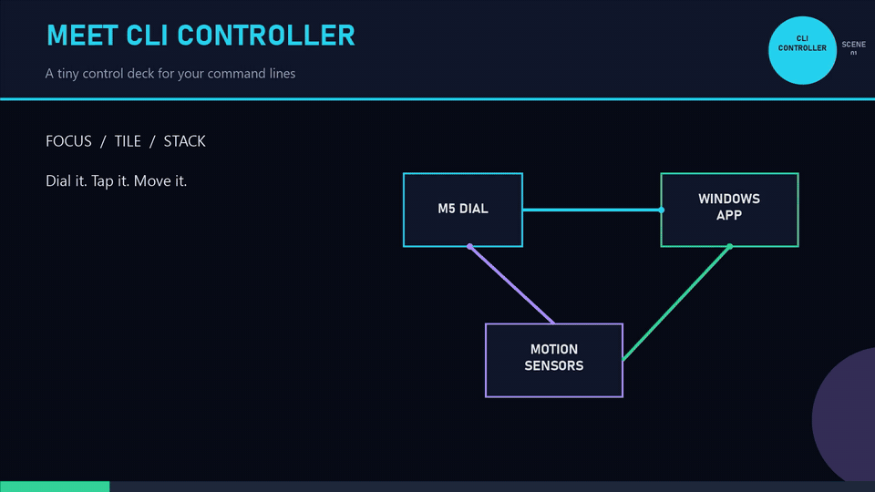
  </a>
</p>

<p align="center">
  <strong><a href="docs/cli-controller-how-to.mp4">▶ Watch the full narrated user guide</a></strong>
  &nbsp;·&nbsp;
  <strong><a href="case/README.md">⬡ Download and print the M5Dial and sensor cases</a></strong>
</p>

CLI Controller turns an M5Stack Dial into a physical control surface for command-line windows on Windows. Rotate the Dial to choose a CLI window. Press to focus it. Tap the screen to tile or stack all supported CLI windows. Optional knee-distance sensors and a desk-motion sensor add hands-free controls.

Firmware 0.5.0 treats every motion sensor as optional. The Dial, display, encoder, button, and touch controls continue to work when no PCA9548 or sensor is connected.

## What it does

- Finds supported CLI windows without including browsers.
- Shows a classic list or a graphical themed overlay.
- Focuses the selected CLI after a configurable idle delay.
- Tiles windows across their monitors or stacks them with visible title bars.
- Rotates the M5Dial display and touch map through any degree value.
- Supports up to four PCA9548-isolated VL53L4CD distance sensors.
- Supports an optional PCA9548-isolated ADXL345 desk-motion sensor.
- Offers two selectable knee-control modes.
- Maps four physical desk directions to Tile, Stack, or no action.
- Recovers from optional-sensor read failures without rebooting the Dial.

## System at a glance

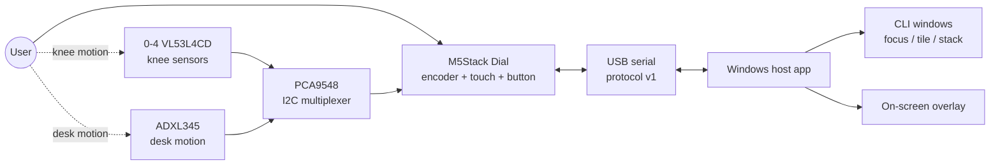

## Parts

### Core parts

| Quantity | Part | Purpose |
|---:|---|---|
| 1 | M5Stack Dial | Display, encoder, push button, touch screen, USB serial, and firmware host |
| 1 | USB-C data cable | Power, flashing, and serial connection to the Windows computer |
| 1 | Windows computer | Runs the tray application and controls CLI windows |

### Optional motion parts

| Quantity | Part | I2C address | PCA9548 channel | Purpose |
|---:|---|---:|---:|---|
| 1 | Adafruit PCA9548 | `0x70` | upstream | Isolates identical-address sensors |
| 1-4 | VL53L4CD distance sensor | `0x29` | 0-3 | Detects left or right knee raises |
| 0-1 | ADXL345 accelerometer | `0x53` | 4 | Detects desk motion in four directions |
| as needed | STEMMA QT/Qwiic or compatible I2C cables | - | - | Connects the mux and sensors |

Channels 5-7 are reserved and unused. A channel number identifies a VL53L4CD; the firmware does not change the sensor's `0x29` address.

## Wiring diagram

M5Dial Port A provides the external I2C connection. This firmware uses GPIO13 for SDA and GPIO15 for SCL. Keep the M5Dial's internal display and touch bus separate.

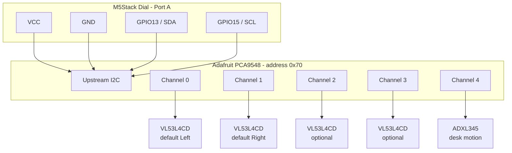

### Wiring checklist

1. Disconnect USB power before changing cables.
2. Connect M5Dial Port A to the PCA9548 upstream connector.
3. Connect distance sensors only to channels 0-3.
4. Connect the ADXL345 only to channel 4.
5. Check the SDA, SCL, power, and ground labels on each board. Do not rely on cable color alone.
6. Reconnect USB. The firmware scans channels automatically.
7. Open Settings. A working device changes from `Not detected` to `Detected`.

The no-hardware path is supported. You can install and use CLI Controller before buying or connecting any motion part.

## Quick start

### Prerequisites

- Windows 10 or 11, x64.
- Go 1.25 or a compatible current Go toolchain.
- Python and [PlatformIO](https://platformio.org/) for firmware builds and flashing.
- An M5Stack Dial connected by a USB data cable.

### Build the Windows application

Run these commands from the repository root in PowerShell:

```powershell
go test ./...
go build -ldflags="-H windowsgui" -o cli-controller.exe ./cmd/cli-controller
```

### Build and flash firmware

The checked-in PlatformIO environment targets `m5stack-stamps3`. The helper defaults to `COM10`; pass a different port when needed.

```powershell
pio run -d firmware
powershell -NoProfile -File .\scripts\flash-dial.ps1 -Port COM10
```

Verify the firmware version and arbitrary display rotation without leaving the normal application stopped:

```powershell
powershell -NoProfile -File .\scripts\verify-dial-rotation.ps1 `
  -Port COM10 `
  -ExpectedFirmware 0.5.0 `
  -Rotation 301 `
  -ObserveSeconds 6
```

A healthy result includes:

```text
PANICS_AFTER_STATE=0
REBOOTS_AFTER_STATE=0
FIRMWARE_HELLO={"v":1,"t":"hello","fw":"0.5.0","dev":"cli-dial"}
```

### Install the Windows application

```powershell
powershell -NoProfile -File .\scripts\install.ps1
```

The installer:

- Copies the executable to `%LOCALAPPDATA%\Programs\cli-controller\cli-controller.exe`.
- Adds `CLI Dial.lnk` to the Start menu.
- Adds the same shortcut to the current user's Startup folder.
- Starts the application.

To remove the installed application and shortcuts:

```powershell
powershell -NoProfile -File .\scripts\uninstall.ps1
```

## Everyday controls

### Physical Dial

| Control | Result |
|---|---|
| Rotate the encoder | Move through supported CLI windows and the Settings item |
| Stop rotating | Activate the selected item after the configured activation delay |
| Press BtnA | Activate the current selection immediately |
| Tap `TILE`, then `OK` or BtnA | Tile supported CLI windows per monitor |
| Tap `STACK`, then `OK` or BtnA | Stack supported CLI windows per monitor |

The Dial shows `Waiting` when the host is unavailable. It returns to the idle Tile/Stack screen after the host connects.

### Knee mode: Arm then select

This is the default mode.

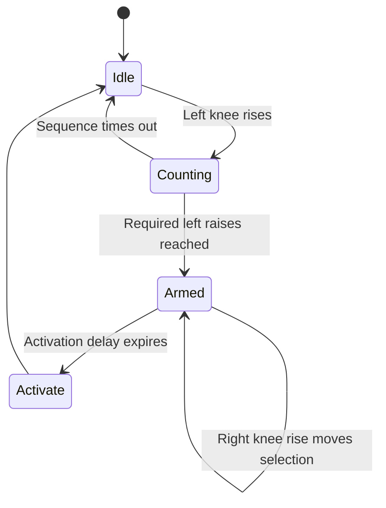

1. Raise the left knee the configured number of times.
2. The overlay opens and becomes armed.
3. Raise the right knee to move one item per complete raise.
4. Stop moving. The current item activates after the configured delay.

If you do not move the right knee, the item that was already selected activates after the same delay.

### Knee mode: Right then confirm

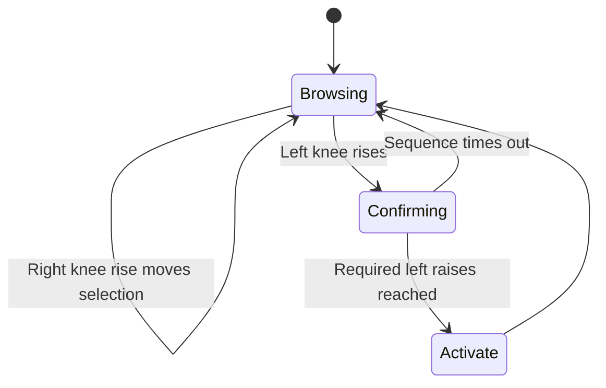

1. Raise the right knee to move through items at any time.
2. Raise the left knee the configured number of times to activate the selection.
3. Right movement alone never activates an item in this mode.

The right direction can be `Down / advance` or `Up / back`. Multiple sensors assigned to the same side share one latch, so overlapping views of one knee still count as one raise.

### Desk motion

Enable the ADXL345 on the Desk tab. The application removes slow gravity and drift, chooses only the dominant physical direction, and waits for the desk to settle before accepting another action.

Each direction can map independently to:

- `None`: ignore the motion.
- `Tile`: tile supported CLI windows.
- `Stack`: stack supported CLI windows.

Set board orientation to match how the ADXL345 is mounted. Start with the default 350 milli-g sensitivity. Raise the value if small bumps trigger actions. Lower it if deliberate motion is not detected.

## Settings

Open Settings from the tray icon, from the final Dial item, or with the developer preview command:

```powershell
.\cli-controller.exe -preview-settings
```

### Controller

Select which CLI families are controlled, choose automatic or manual serial connection, and set the shared activation delay.

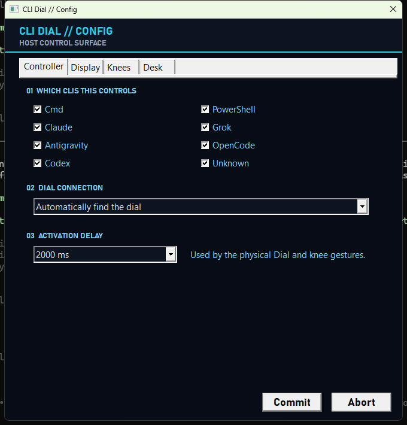

### Display

Choose the classic list or graphical Dial overlay, select one of the included graphical themes, and rotate the M5Dial display to any degree.

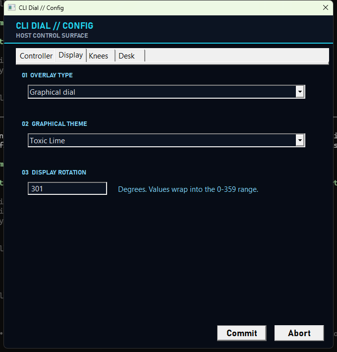

### Knees

Choose the gesture mode, left-raise count, right direction, and each channel's role and distance threshold. Hardware status is live. Saving still works when sensors are absent.

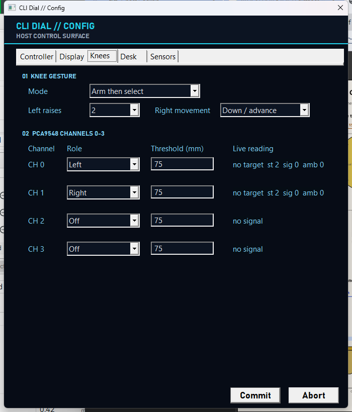

### Desk

Enable or disable desk motion, set orientation and sensitivity, and map Left, Right, Forward, and Back independently.

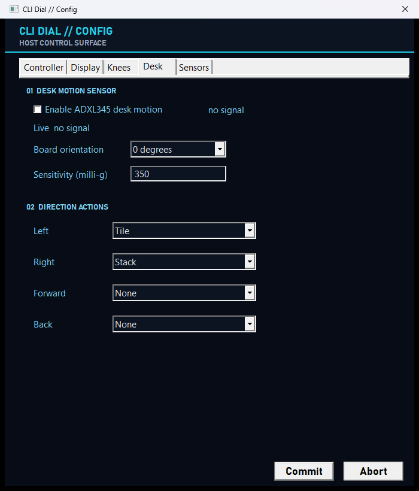

`Commit` saves the current controls. `Abort` closes the dialog without saving.

## Runtime flow

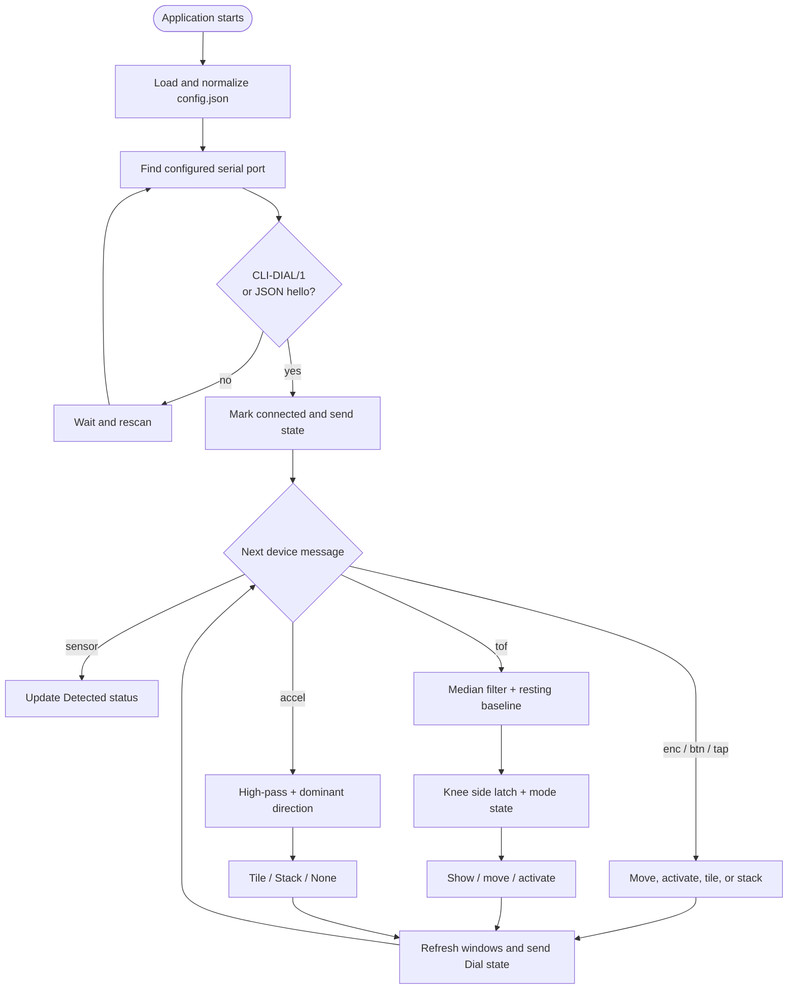

## Sensor processing

### Distance sensors

- Each channel uses a three-sample median.
- A slowly moving baseline represents the resting distance.
- A raise begins when distance decreases by the channel threshold.
- Release requires returning to half the threshold for at least 150 ms.
- Sensors assigned to one side use a shared OR latch.
- A disconnect clears the channel without leaving its side latched.
- Partial left sequences expire after the configured activation delay.

### Accelerometer

- Firmware sends milli-g values at 50 Hz.
- The host high-pass filters X and Y to remove gravity and slow drift.
- Board orientation rotates physical directions in 90-degree steps.
- Only the dominant axis fires.
- Another desk action requires 500 ms below the release threshold.
- The rebound from one movement cannot trigger its opposite direction.

## Architecture

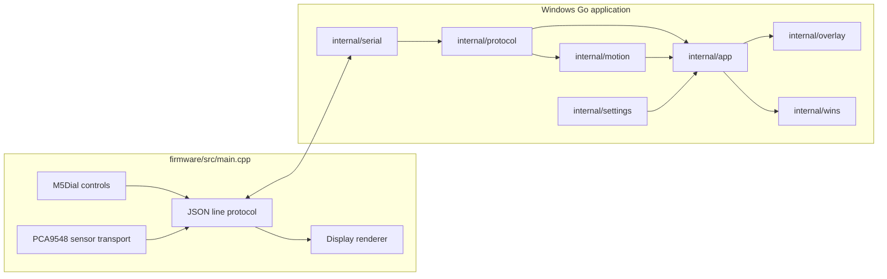

The firmware owns hardware polling and presentation on the round Dial display. The Windows application owns configuration, window discovery and layout, motion interpretation, the desktop overlay, and persistence.

## USB serial protocol

The protocol is newline-delimited JSON at 115200 baud. Maximum host line length is 512 bytes. Protocol version remains `1`; motion messages extend it without changing existing messages.

### Device to host

| Type | Example | Meaning |
|---|---|---|
| Banner | `CLI-DIAL/1` | Legacy-compatible Dial greeting |
| `hello` | `{"v":1,"t":"hello","fw":"0.5.0","dev":"cli-dial"}` | Firmware identity |
| `enc` | `{"v":1,"t":"enc","d":-2}` | Encoder delta |
| `tap` | `{"v":1,"t":"tap","id":"tile"}` | Confirmed Tile or Stack touch action |
| `btn` | `{"v":1,"t":"btn","id":"a"}` | BtnA activation |
| `pong` | `{"v":1,"t":"pong"}` | Ping response |
| `sensor` | `{"v":1,"t":"sensor","ch":0,"kind":"tof","ok":true}` | Connection-state change |
| `tof` | `{"v":1,"t":"tof","ch":0,"mm":421}` | Valid distance sample |
| `accel` | `{"v":1,"t":"accel","ch":4,"x":12,"y":-410,"z":1002}` | Acceleration in milli-g |

### Host to device

| Type | Key fields | Meaning |
|---|---|---|
| `hello` | `app` | Identifies the Windows application |
| `ping` | - | Keeps the link active and requests `pong` |
| `state` | `link`, `n`, `sel`, `brand`, `title`, `rot` | Updates connection state, selection, and display rotation |

## Configuration reference

Configuration is stored at `%APPDATA%\cli-controller\config.json`. Logs are stored beside it in `cli-controller.log`. Old configuration files remain valid because missing or invalid motion fields normalize to defaults.

| JSON field | Valid values | Default |
|---|---|---|
| `portMode` | `auto`, `manual` | `auto` |
| `port` | Windows COM port name | empty |
| `lastSerial` | Last device serial identity | empty |
| `dwellMs` | `250`, `500`, `750`, `1000`, `1500`, `2000` | `2000` |
| `overlayView` | `classic`, `graphical` | `classic` |
| `overlayTheme` | Installed theme ID | `neon-core` |
| `displayRotation` | Any integer, normalized to 0-359 | `0` |
| `brands` | Boolean map of CLI brands | all enabled |
| `kneeMode` | `arm`, `confirm` | `arm` |
| `kneeLeftRaises` | `1`-`3` | `2` |
| `kneeRightDirection` | `1` advance, `-1` back | `1` |
| `kneeChannels[].role` | `off`, `left`, `right` | Left, Right, Off, Off |
| `kneeChannels[].thresholdMm` | `10`-`300` | `75` |
| `deskEnabled` | `true`, `false` | `false` |
| `deskSensitivityMg` | `50`-`2000` | `350` |
| `deskOrientation` | `0`, `90`, `180`, `270` | `0` |
| `deskLeft` | `none`, `tile`, `stack` | `tile` |
| `deskRight` | `none`, `tile`, `stack` | `stack` |
| `deskForward` | `none`, `tile`, `stack` | `none` |
| `deskBack` | `none`, `tile`, `stack` | `none` |

## Supported CLI families

The Controller tab can enable or disable these classifiers independently:

- Command Prompt
- PowerShell
- Claude
- Grok
- Antigravity
- OpenCode
- Codex
- Unknown CLI windows

Window enumeration, per-monitor tiling, and title-bar-preserving stacking live in `internal/wins`.

## Developer commands

```powershell
# Unit and Windows package tests
go test ./...

# Windows GUI executable
go build -ldflags="-H windowsgui" -o cli-controller.exe ./cmd/cli-controller

# Enumerate and validate window layouts
.\cli-controller.exe -selftest

# Show the configured overlay for 15 seconds
.\cli-controller.exe -preview

# Preview a specific graphical theme
.\cli-controller.exe -preview -theme toxic-lime

# Show the settings dialog for 15 seconds
.\cli-controller.exe -preview-settings

# Firmware build
pio run -d firmware

# Rebuild the narrated documentation video (requires edge-tts)
powershell -NoProfile -File .\docs\video\build-how-to-video.ps1
```

## Repository layout

```text
cmd/cli-controller/       Windows application entry point and preview modes
case/                     Printable STL/3MF cases, parametric sources, drawings, and model guides
firmware/                 PlatformIO M5Dial firmware
internal/app/             Application event loop and action coordination
internal/config/          Defaults, normalization, load, and save
internal/motion/          Knee and desk gesture engine
internal/overlay/         Classic and graphical desktop overlays
internal/protocol/        Version 1 JSON line protocol
internal/serial/          Port discovery and reconnect manager
internal/settings/        Native four-tab Windows settings dialog
internal/tray/            Notification-area icon and menu
internal/win32/           Narrow Win32 bindings
internal/wins/            CLI discovery, focus, tile, and stack behavior
docs/images/              Verified settings screenshots
docs/video/               Video storyboard and reproducible builder
scripts/                  Flash, verify, install, uninstall, and secret helpers
```

## Continuous integration and delivery

A push to `main` runs `.github/workflows/build.yml`:

- `windows-app` runs all Go tests, builds the Windows GUI executable, and uploads it as `cli-controller-windows`.
- `firmware` installs PlatformIO, builds the M5Dial firmware, and uploads `firmware-bin`.

Local builds are for verification and installation. Repository delivery is complete only after the `main` workflow reaches a successful terminal result.

## Troubleshooting

### The Dial says `Waiting`

- Confirm the Windows application is running in the notification area.
- Confirm the USB cable supports data, not only charging.
- Check `%APPDATA%\cli-controller\cli-controller.log` for `connected COMx`.
- Select the correct port manually on the Controller tab if automatic discovery cannot identify it.

### Flashing cannot open the COM port

- Close serial monitors.
- Stop the installed application or let `flash-dial.ps1` stop it.
- Reconnect the Dial and check its current port in Device Manager.
- Retry with the exact port: `-Port COM10`.

### A sensor says `Not detected`

- Confirm the PCA9548 is on the M5Dial external I2C bus at `0x70`.
- Confirm VL53L4CD sensors use channels 0-3 and ADXL345 uses channel 4.
- Check power, ground, SDA, and SCL at both ends of each cable.
- Leave the application open. Firmware rescans failed or absent channels.

### Knee raises trigger too easily

- Increase that channel's threshold toward 300 mm.
- Aim the sensor at one knee and reduce overlapping fields of view.
- Wait for a full release before raising the same knee again.

### Knee raises are missed

- Decrease the threshold toward 10 mm.
- Check that the channel role matches the physical side.
- Verify the hardware status reads `Detected`.

### Desk motion triggers from bumps

- Increase sensitivity above 350 milli-g.
- Confirm the board orientation matches the physical mount.
- Map unused directions to `None`.

### The display is rotated but touch feels wrong

- Save the desired degree value on the Display tab so the host sends the same rotation back to the Dial.
- Run `verify-dial-rotation.ps1` with that exact value and check for zero panics and reboots.

## Safety and limitations

- Disconnect USB power before rewiring I2C parts.
- Secure sensors and cables before using leg gestures. Loose cables are a trip hazard.
- Motion actions control live desktop windows. Start with low-risk CLI sessions while tuning thresholds.
- Synthetic tests cover filtering, latches, knee modes, and desk rebound behavior.
- Final sensor placement, physical gesture validation, and sensitivity tuning require the real mounted hardware and remain in `backlog.md`.

## How-to video source

The checked-in MP4 is generated from the real settings screenshots. Its source storyboard is in [`docs/video/storyboard.md`](docs/video/storyboard.md), and its reproducible Windows builder is [`docs/video/build-how-to-video.ps1`](docs/video/build-how-to-video.ps1). The script uses Microsoft neural speech through `edge-tts`, System.Drawing, and FFmpeg; it does not add product or runtime dependencies. Install the builder-only voice tool with `python -m pip install --user edge-tts`. Video generation sends only the storyboard narration text to Microsoft's speech service.
