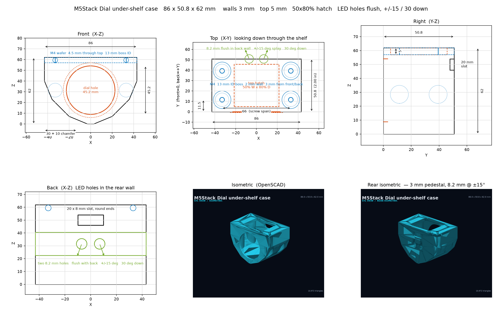
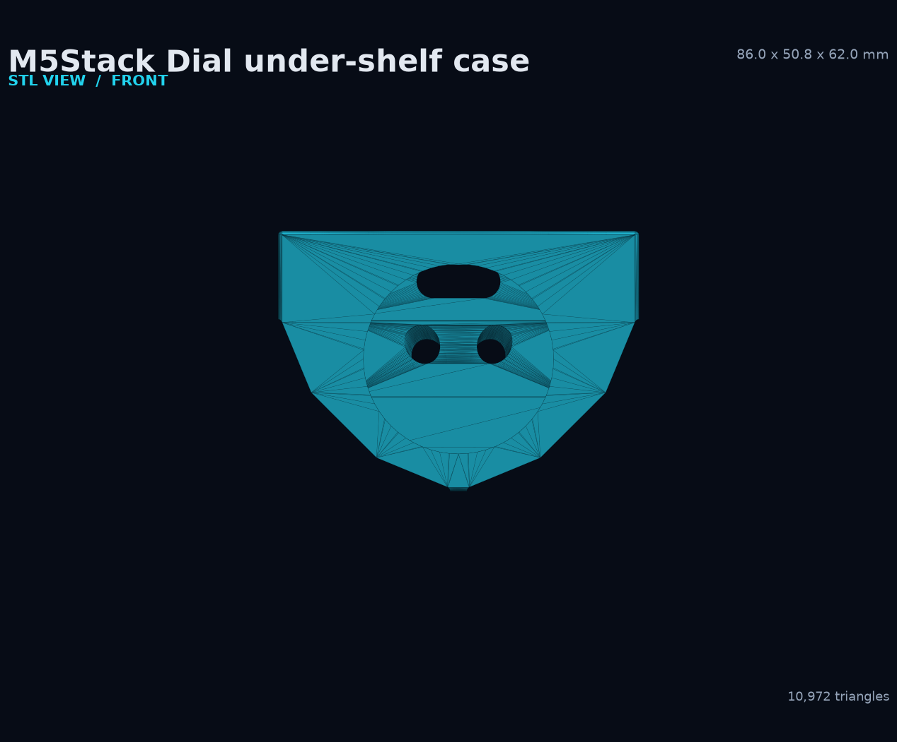
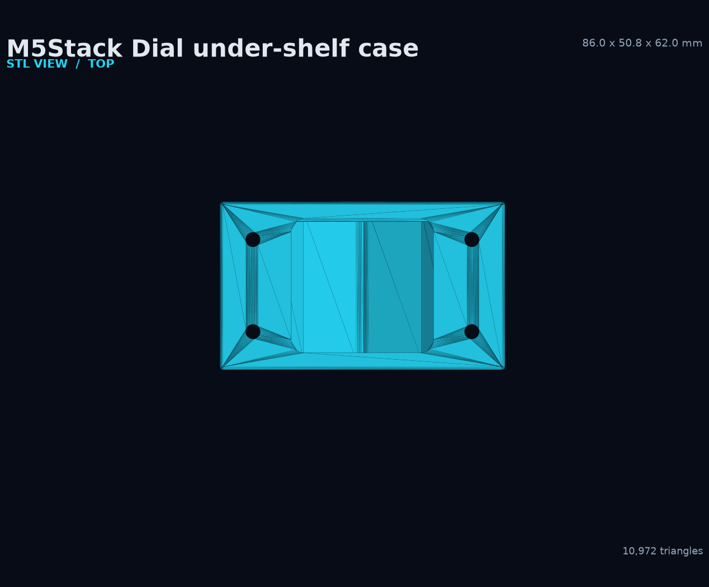
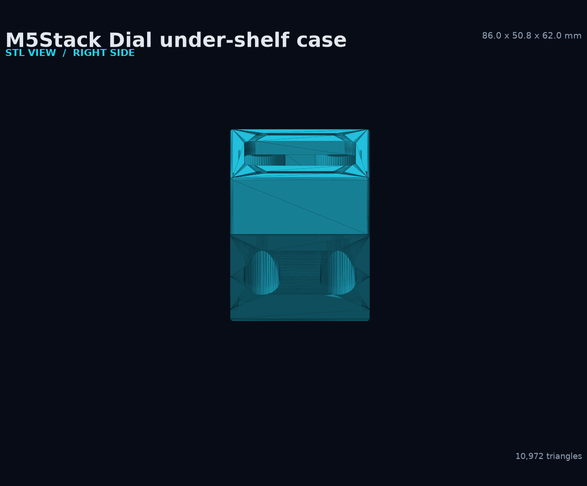
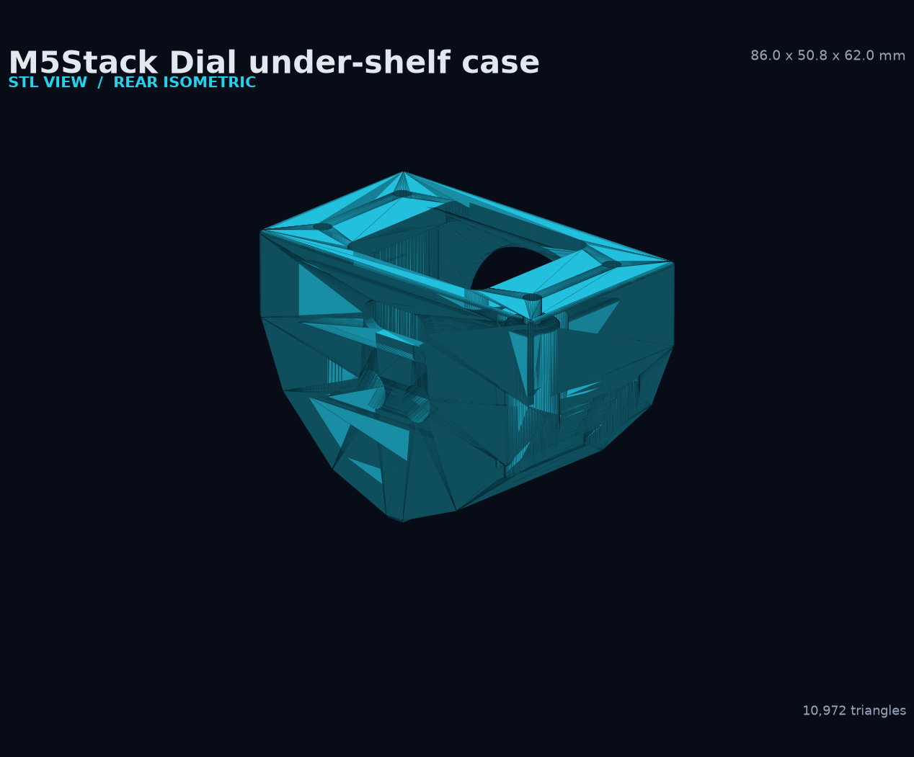

# M5Stack Dial under-shelf case

[Download the STL](m5dial_shelf_case.stl) · [OpenSCAD source](m5dial_shelf_case.scad) · [MATLAB drawing source](m5dial_shelf_case.m) · [Python drawing source](draw_m5dial_case.py) · [All printable cases](README.md)


This enclosure mounts an M5Stack Dial under a shelf. It exposes the round Dial face at the front, provides a large top service hatch, four M4 shelf-mount locations with internal bosses, a rear cable slot, and two angled rear holes for downward-facing indicators or accessories.

## Key dimensions

| Feature | Dimension |
|---|---:|
| Overall envelope | 86.0 × 50.8 × 62.0 mm |
| Wall thickness | 3.0 mm |
| Top thickness | 5.0 mm |
| Dial bezel reference | 51.0 mm diameter |
| Dial opening | 45.2 mm diameter plus 0.2 mm print allowance |
| M4 clearance | 4.5 mm |
| Internal boss opening | 13.0 mm |
| Cable slot | 20.0 × 8.0 mm, rounded ends |
| Rear angled holes | 8.2 mm, ±15 degrees splay and 30 degrees down |
| Top hatch | 50% of case width × 80% of case depth |

The exact parameters and derived values are defined at the top of [`m5dial_shelf_case.scad`](m5dial_shelf_case.scad).

## MATLAB mechanical drawing

[`m5dial_shelf_case.m`](m5dial_shelf_case.m) contains the native MATLAB drawing. The checked-in preview below uses the matching dimensions and MATLAB palette so the drawing remains reviewable without MATLAB installed.

[](m5dial_shelf_case_drawing.png)

Run the native drawing in MATLAB:

```matlab
cd case
m5dial_shelf_case
```

## STL views

| Front | Rear |
|---|---|
| [](m5dial_shelf_case_front.png) | [](m5dial_shelf_case_back.png) |

| Top | Bottom |
|---|---|
| [](m5dial_shelf_case_top.png) | [](m5dial_shelf_case_bottom.png) |

| Right side | Rear isometric |
|---|---|
| [](m5dial_shelf_case_side.png) | [](m5dial_shelf_case_backiso.png) |

## Print guidance

The OpenSCAD source specifies this starting profile:

- Put the top face on the bed for accurate M4 holes.
- Use a 0.20 mm layer height.
- Use at least three perimeters.
- Start at 30% infill.
- Support the bottom plate where the slicer marks an unsupported span.

Check these points in the slicer preview:

- The 45.2 mm Dial opening remains round at the chosen layer height.
- The four M4 holes and 13 mm internal boss openings are clear.
- Support is removable through the top hatch.
- The 20 × 8 mm cable slot has enough bend clearance for the selected USB cable.
- The two rear angled holes are oriented down and away as intended.

## Regeneration

Generate the STL with OpenSCAD:

```powershell
openscad -o .\case\m5dial_shelf_case.stl .\case\m5dial_shelf_case.scad
```

Regenerate its STL views and drawing preview:

```powershell
python .\case\render_stl_views.py
python .\case\draw_m5dial_case.py
```

The checked-in STL processes as a watertight mesh with 10,972 triangles.
