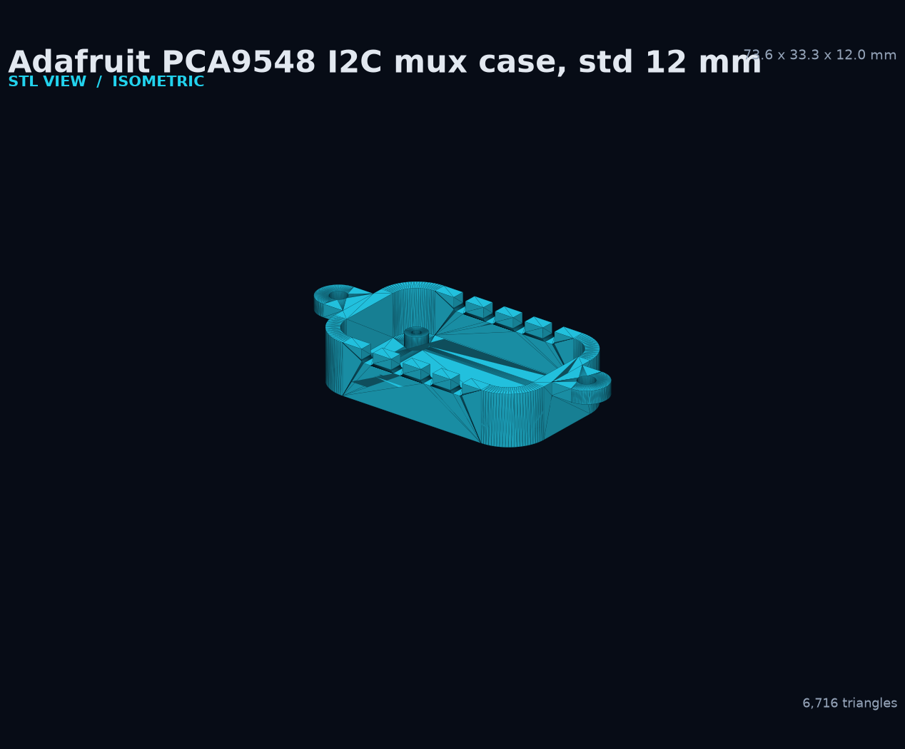
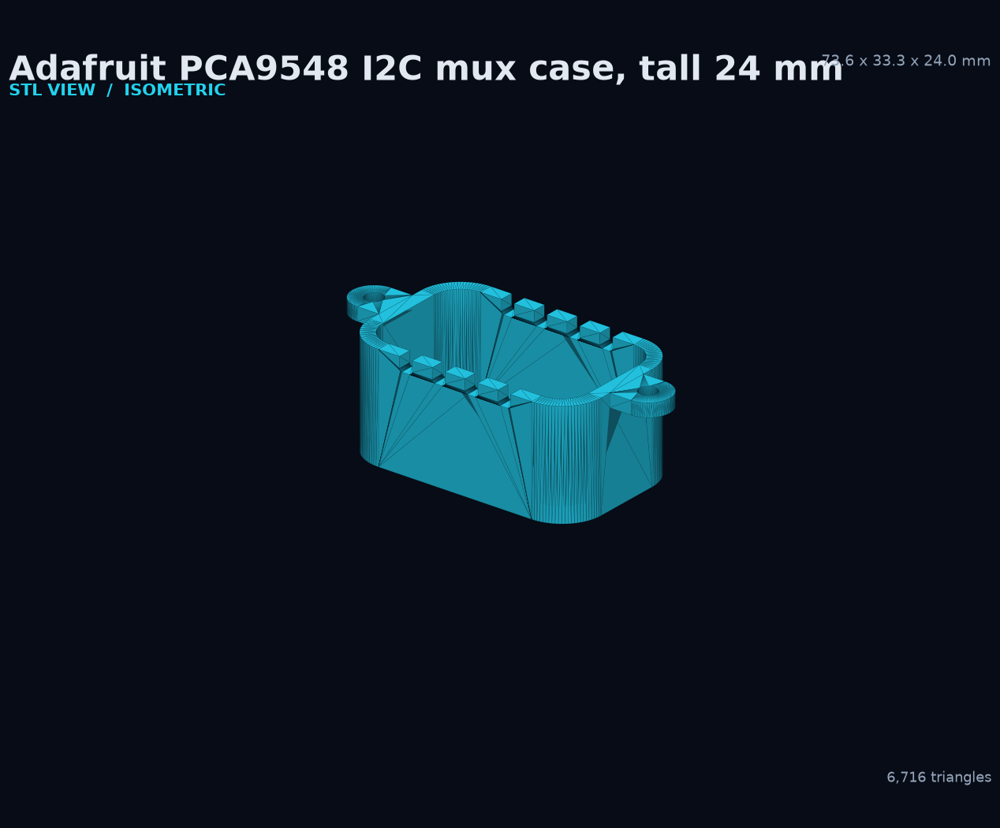
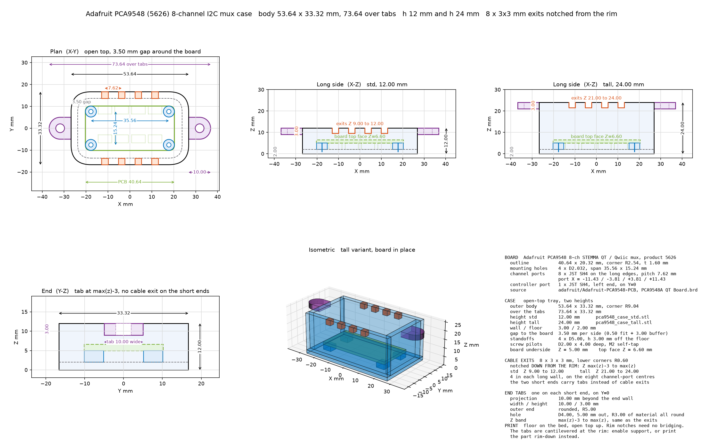

# Adafruit PCA9548 I2C multiplexer case

Open-top tray for the [Adafruit PCA9548 8-Channel STEMMA QT / Qwiic I2C
Multiplexer, product 5626](https://www.adafruit.com/product/5626). Two heights,
a 3 mm buffer around the board, eight cable exits notched down from the rim,
and a mounting tab on each short end.

| Standard, 12 mm | Tall, 24 mm |
|---|---|
|  |  |
| [Download STL](pca9548_case_std.stl) | [Download STL](pca9548_case_tall.stl) |



## Board data

Every board number is read from Adafruit's own Eagle file,
[`adafruit/Adafruit-PCA9548-PCB`](https://github.com/adafruit/Adafruit-PCA9548-PCB)
→ `PCA9548A QT Board.brd` (Eagle 9.6.2). Nothing here is estimated from a photo
or from the marketing dimensions.

| Feature | Value | Source in the .brd |
|---|---|---|
| Outline | 40.64 x 20.32 mm, corner R2.54 | layer 20 wires and 90 deg curves |
| Thickness | 1.60 mm PCB, 4.8 mm with parts | Adafruit product page |
| Mounting holes | 4 x D2.032, span 35.56 x 15.24 mm | two `<hole>` + two `MOUNTINGHOLE_2.5_PLATED` |
| Channel ports | 8 x `JST_SH4`, board x 8.89 / 16.51 / 24.13 / 31.75, y 3.048 and 17.272 | `CONN1 CONN2 CONN5 CONN6 CONN7 CONN8 CONN9 CONN10` |
| Controller port | 1 x `JST_SH4`, board x 3.175, y 10.16 (left end, on centre) | `CONN4` |

The model is centred, so board coordinates are shifted by (-20.32, -10.16).
Channel-port centres become X = -11.43 / -3.81 / +3.81 / +11.43, and the
controller port lands exactly on Y = 0.

## Case

| Parameter | Value |
|---|---|
| Outer body | 53.64 x 33.32 mm, corner R9.04 |
| Overall, across the tabs | 73.64 x 33.32 mm |
| Height | 12.00 mm (`std`) or 24.00 mm (`tall`) |
| Wall / floor | 3.00 / 2.00 mm |
| Gap to the board | 3.50 mm per side (0.50 mm print fit + 3.00 mm buffer) |
| Standoffs | 4 x D5.00, 3.00 mm off the floor top |
| Screw pilots | D2.00 x 4.00 mm deep, for M2 self-tapping screws |
| Board underside | Z = 5.00 mm |
| Board top face | Z = 6.60 mm |

The board goes in **component-side down**. The four standoffs are 3.00 mm tall,
which clears the 2.9 mm JST SH shells. The 3.50 mm gap on every side leaves
room for a cable to turn up out of a connector and reach the rim.

## Cable exits

Eight 3.00 x 3.00 mm exits, lower corners R0.60, notched **down from the rim**:

| Variant | Exit Z band |
|---|---|
| `std`, height 12.00 | 9.00 to 12.00 |
| `tall`, height 24.00 | 21.00 to 24.00 |

Four sit in each long wall, on the eight JST SH channel-port centres. Because
they open onto the rim they print with no bridging at all.

The two short ends carry tabs and **no** cable exits. A tab and an exit would
occupy the same `max(z) - 3` band on the same wall, so the tab would sit
directly across the mouth of an end exit and block it. Cables from the
controller-side port leave over the open top or through a nearby long-wall exit.

## End tabs

One tab on each short end, centred on Y = 0:

| Parameter | Value |
|---|---|
| Projection | 10.00 mm beyond the end wall |
| Width | 10.00 mm |
| Thickness | 3.00 mm, in the `max(z) - 3` band |
| Outer end | rounded, R5.00 |
| Hole | D4.00, 5.00 mm out, so R3.00 of material all round it |

The 4 mm hole sits at the centre of the rounded end, which is why the tab is
10 mm wide: it keeps 3.00 mm of material around the hole on every side.

## Printing

Print floor-down, open top up.

- The rim notches need no bridging.
- The two end tabs are cantilevered at the rim with nothing beneath them.
  **Enable support for them**, or print the part rim-down instead, which puts
  both tabs flat on the bed and turns the floor into a bridge.

```powershell
& 'C:\Program Files\OpenSCAD\openscad.com' -o case\pca9548_case_std.stl  -D 'variant="std"'  case\pca9548_case.scad
& 'C:\Program Files\OpenSCAD\openscad.com' -o case\pca9548_case_tall.stl -D 'variant="tall"' case\pca9548_case.scad
```

## Regenerate the documentation images

```powershell
python .\case\draw_pca9548_case.py
python .\case\render_stl_views.py pca9548_case_std pca9548_case_tall
```

Run `pca9548_case.m` in MATLAB when a native MATLAB export is required.

## Model checks

Both files load as one triangle mesh and are watertight after normal vertex
processing:

| Model | Triangles | Bounds, mm | Volume, mm3 | Watertight |
|---|---:|---|---:|---|
| `pca9548_case_std.stl` | 6,716 | 73.64 x 33.32 x 12.00 | 8335.19 | Yes |
| `pca9548_case_tall.stl` | 6,716 | 73.64 x 33.32 x 24.00 | 13697.09 | Yes |

Thirty-four point-containment probes pass on each file. They confirm that all
eight rim notches are open at their mid-height, that the wall is solid below
each notch and between adjacent notches, that both short-end walls are solid on
centre, that each tab is solid at 2 mm and 9.5 mm out and empty past 10.5 mm
out and 1 mm below its band, that each D4.00 tab hole is open on axis and solid
2.6 mm off axis, that the 3.50 mm buffer is open where wall used to be, and
that the four screw pilots are open on axis and closed 1.00 mm above the bed.

Review the slicer preview before printing. Printer calibration, material
shrinkage, cable bend radius, screw-head geometry, and board revisions can
change the final fit.
