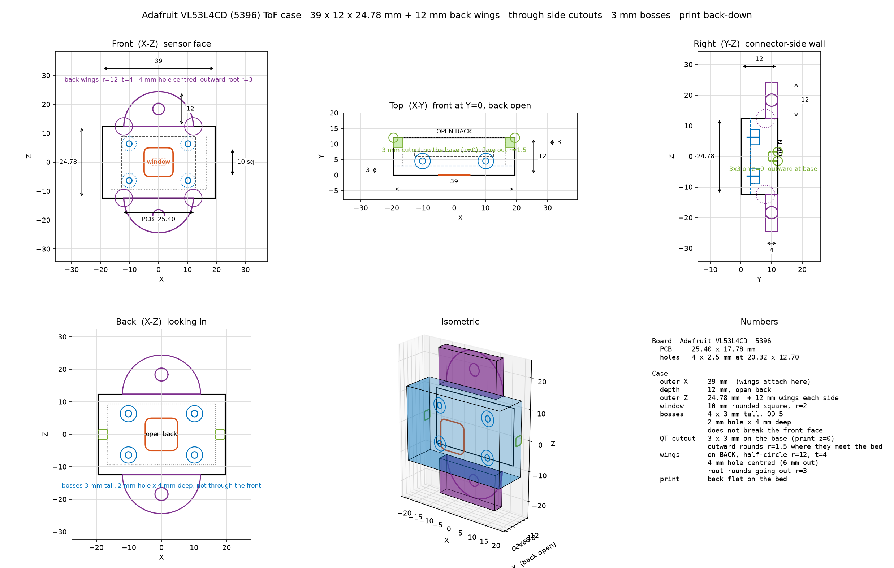
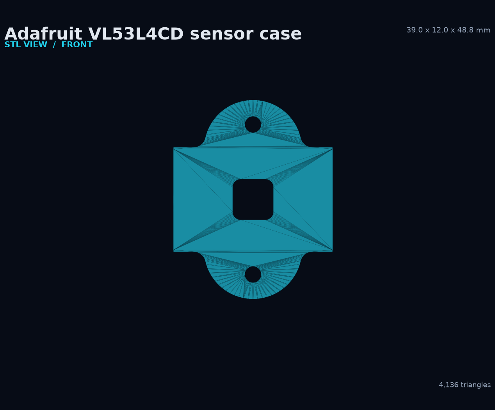
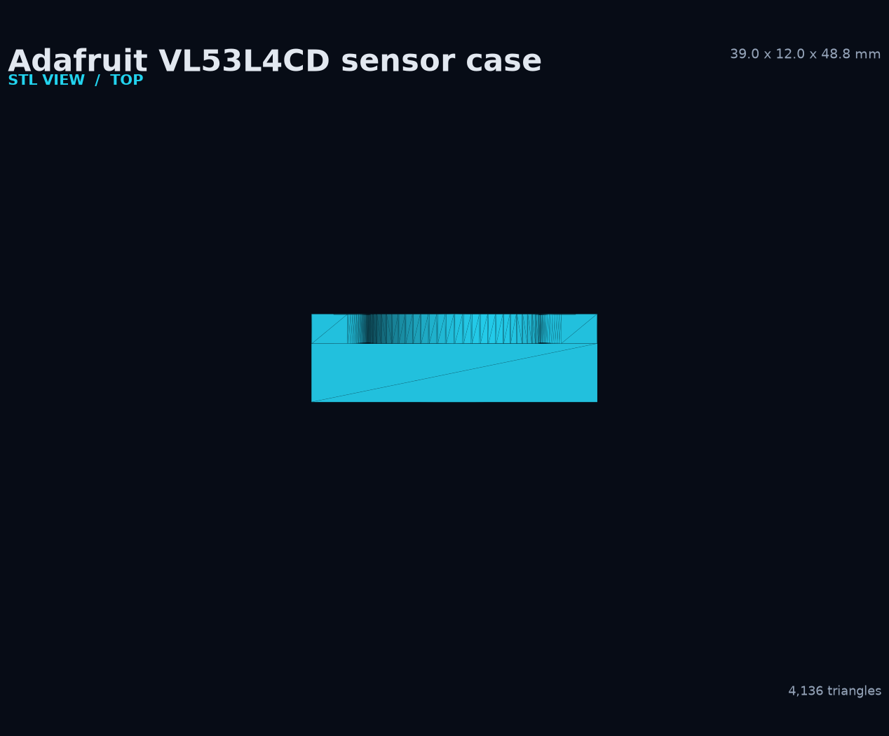
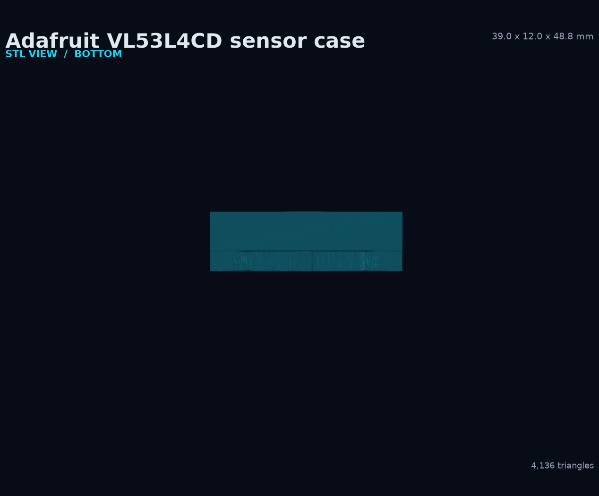
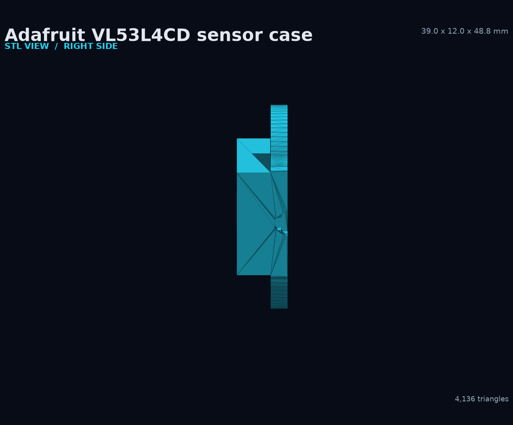
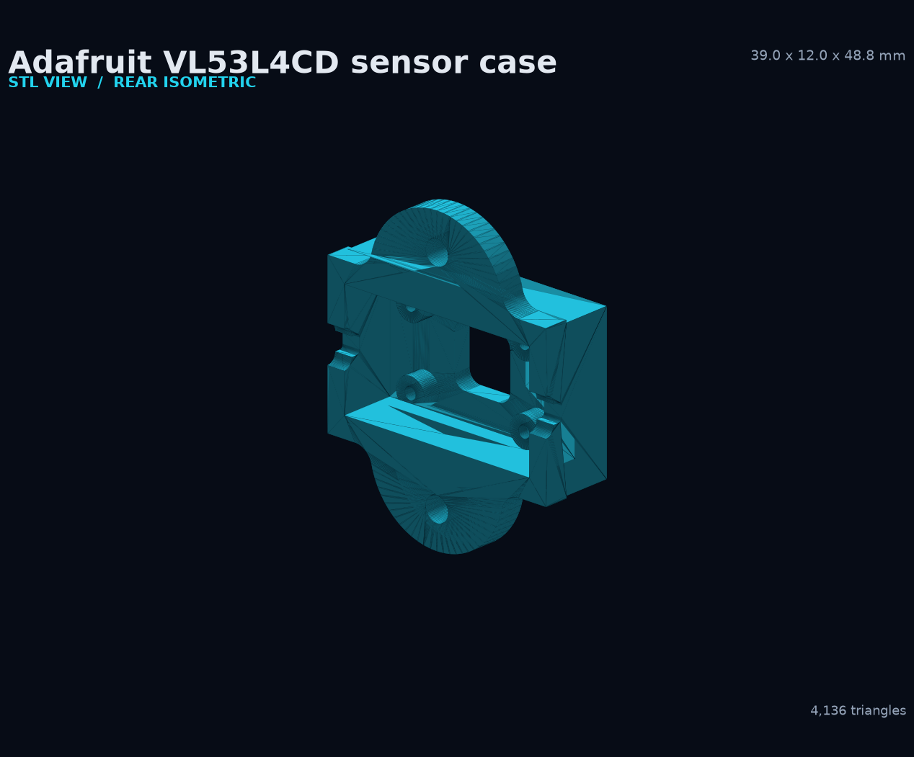

# Adafruit VL53L4CD sensor case

[Download the STL](vl53l4cd_case.stl) · [Download the 3MF](vl53l4cd_case.3mf) · [OpenSCAD source](vl53l4cd_case.scad) · [MATLAB drawing source](vl53l4cd_case.m) · [Python drawing source](draw_vl53l4cd_case.py) · [All printable cases](README.md)


This compact open-back case fits the Adafruit VL53L4CD time-of-flight breakout, product 5396. It has a rounded 10 mm sensor window, four internal board bosses, two half-circle mounting wings, 4 mm mounting holes, and side cable cutouts for the board connectors.

## Key dimensions

| Feature | Dimension |
|---|---:|
| Main case | 39.0 × 12.0 × 24.78 mm |
| Envelope including wings | 39.0 × 12.0 × 48.78 mm |
| Target PCB | 25.40 × 17.78 × 1.60 mm |
| PCB mounting span | 20.32 × 12.70 mm |
| Wall and front thickness | 3.0 mm |
| Sensor window | 10.0 mm rounded square, 2.0 mm corner radius |
| Internal bosses | 5.0 mm outside diameter × 3.0 mm tall |
| Boss pilot holes | 2.0 mm diameter × 4.0 mm deep |
| Mounting wings | 12.0 mm radius × 4.0 mm thick |
| Wing holes | 4.0 mm diameter, centered 6.0 mm out |
| Side cable cutouts | 3.0 × 3.0 mm with rounded bed contact |

The pilot holes stop before the front face. They do not break through the sensor side of the case.

## MATLAB mechanical drawing

[`vl53l4cd_case.m`](vl53l4cd_case.m) contains the native MATLAB drawing. The preview below uses the same board and case parameters and a MATLAB-compatible palette.

[](vl53l4cd_case_drawing.png)

Run the native drawing in MATLAB:

```matlab
cd case
vl53l4cd_case
```

## STL views

| Front | Rear |
|---|---|
| [](vl53l4cd_case_stl_front.png) | [](vl53l4cd_case_stl_back.png) |

| Top | Bottom |
|---|---|
| [](vl53l4cd_case_stl_top.png) | [](vl53l4cd_case_stl_bottom.png) |

| Right side | Rear isometric |
|---|---|
| [](vl53l4cd_case_stl_side.png) | [](vl53l4cd_case_stl_rear_iso.png) |

## Fit and mounting

1. Route the sensor cable through the appropriate side cutout.
2. Place the board against the four 3 mm bosses.
3. Align the VL53L4CD emitter and receiver with the rounded-square window.
4. Use hardware appropriate for the 2 mm pilot holes. Do not drive a screw through the front face.
5. Mount the case through the two 4 mm wing holes.
6. Aim the sensor at the intended knee travel and keep cables outside the leg path.

## Print guidance

- Put the open back flat on the bed, as specified by the OpenSCAD source.
- Start with a 0.20 mm layer height and at least three perimeters.
- Inspect the 10 mm window, 2 mm pilot holes, 3 mm cable cutouts, and wing roots in the slicer.
- Confirm the selected material provides enough stiffness at the two mounting wings.
- Print one test case before committing to all four sensor positions.

The included [`vl53l4cd_case.3mf`](vl53l4cd_case.3mf) is available for slicers that preserve 3MF model metadata.

## Regeneration

Generate the STL with OpenSCAD:

```powershell
openscad -o .\case\vl53l4cd_case.stl .\case\vl53l4cd_case.scad
```

Regenerate its STL views and drawing preview:

```powershell
python .\case\render_stl_views.py
python .\case\draw_vl53l4cd_case.py
```

The checked-in STL processes as a watertight mesh with 4,136 triangles.
