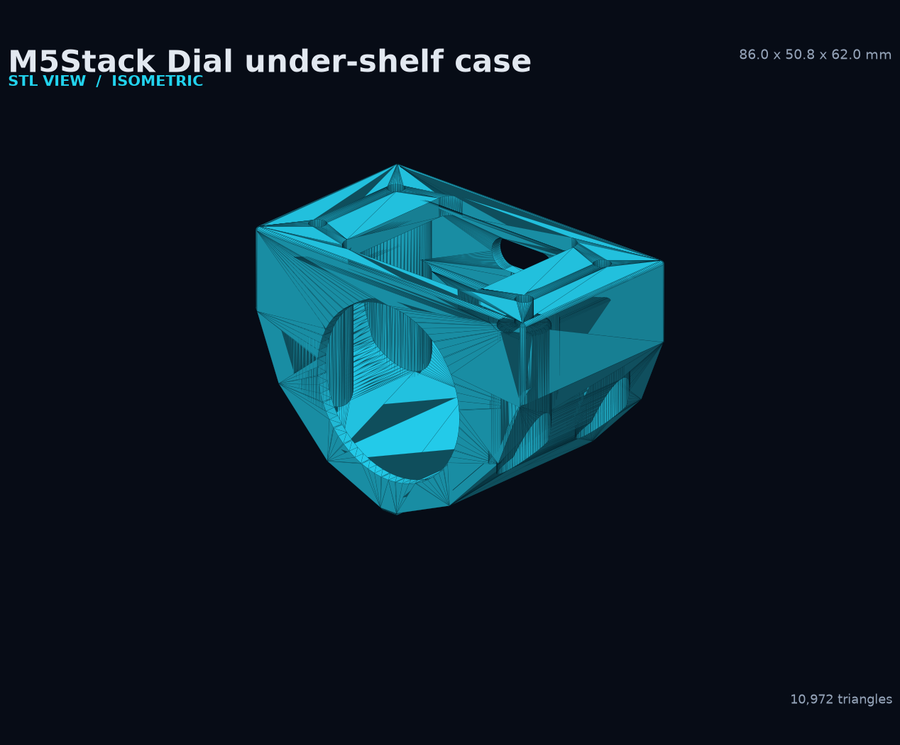
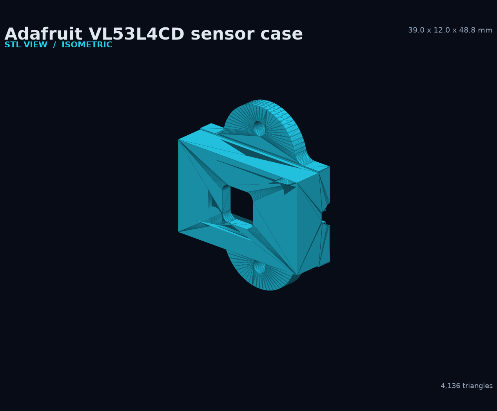

# Printable cases

This directory contains ready-to-slice, watertight STL models for CLI Controller hardware. Each model includes its parametric OpenSCAD source, MATLAB mechanical-drawing source, a checked-in drawing sheet, and STL renders from multiple angles.

| M5Stack Dial under-shelf case | Adafruit VL53L4CD sensor case | Adafruit PCA9548 I2C mux case |
|---|---|---|
| [](README-m5dial-shelf-case.md) | [](README-vl53l4cd-case.md) | [](README-pca9548-case.md) |
| **[Open the M5Dial case guide](README-m5dial-shelf-case.md)** | **[Open the VL53L4CD case guide](README-vl53l4cd-case.md)** | **[Open the PCA9548 case guide](README-pca9548-case.md)** |
| [Download STL](m5dial_shelf_case.stl) | [Download STL](vl53l4cd_case.stl) · [Download 3MF](vl53l4cd_case.3mf) | [Download std STL](pca9548_case_std.stl) · [Download tall STL](pca9548_case_tall.stl) |

## Source and artifact map

| Case | Parametric source | MATLAB drawing source | Drawing preview | Print mesh |
|---|---|---|---|---|
| M5Dial shelf case | [`m5dial_shelf_case.scad`](m5dial_shelf_case.scad) | [`m5dial_shelf_case.m`](m5dial_shelf_case.m) | [`m5dial_shelf_case_drawing.png`](m5dial_shelf_case_drawing.png) | [`m5dial_shelf_case.stl`](m5dial_shelf_case.stl) |
| VL53L4CD case | [`vl53l4cd_case.scad`](vl53l4cd_case.scad) | [`vl53l4cd_case.m`](vl53l4cd_case.m) | [`vl53l4cd_case_drawing.png`](vl53l4cd_case_drawing.png) | [`vl53l4cd_case.stl`](vl53l4cd_case.stl) · [`vl53l4cd_case.3mf`](vl53l4cd_case.3mf) |
| PCA9548 mux case | [`pca9548_case.scad`](pca9548_case.scad) | [`pca9548_case.m`](pca9548_case.m) | [`pca9548_case_drawing.png`](pca9548_case_drawing.png) | [`pca9548_case_std.stl`](pca9548_case_std.stl) · [`pca9548_case_tall.stl`](pca9548_case_tall.stl) |

The PCA9548 case is one source file with two heights. Pick the variant on the command line:

```powershell
& 'C:\Program Files\OpenSCAD\openscad.com' -o case\pca9548_case_std.stl  -D 'variant="std"'  case\pca9548_case.scad
& 'C:\Program Files\OpenSCAD\openscad.com' -o case\pca9548_case_tall.stl -D 'variant="tall"' case\pca9548_case.scad
```

## Regenerate the documentation images

The renderer reads the actual STL triangles. It does not approximate the shape from screenshots. Pass model stems to `render_stl_views.py` to re-render only those models.

```powershell
python .\case\render_stl_views.py
python .\case\draw_m5dial_case.py
python .\case\draw_vl53l4cd_case.py
python .\case\draw_pca9548_case.py
```

The drawing scripts use Matplotlib with MATLAB-compatible colors and the same dimensional parameters as the `.m` and `.scad` sources. Run the `.m` files in MATLAB when a native MATLAB export is required.

## Model checks

Every checked-in STL file loads as one triangle mesh and is watertight after normal vertex processing:

| Model | Triangles | Bounds, mm | Watertight |
|---|---:|---|---|
| M5Dial shelf case | 10,972 | 86.0 × 50.8 × 62.0 | Yes |
| VL53L4CD case | 4,136 | 39.0 × 12.0 × 48.8 including wings | Yes |
| PCA9548 mux case, std | 7,504 | 47.64 × 27.32 × 12.00 | Yes |
| PCA9548 mux case, tall | 7,504 | 47.64 × 27.32 × 24.00 | Yes |

Review slicer previews before printing. Printer calibration, material shrinkage, cable bend radius, screw-head geometry, and board revisions can change the final fit.
